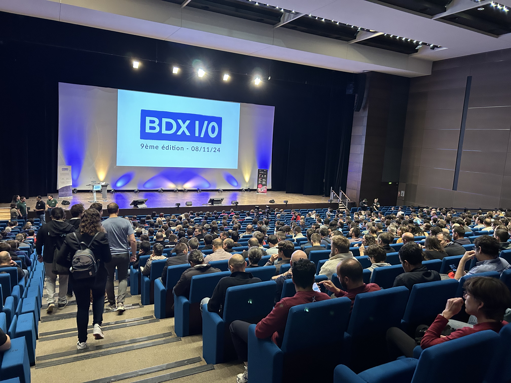

J'ai vu plein de talks incroyables au BDX.io 2024 ! Regardons ensemble les talks qui m'ont le plus marqué, ce que j'ai appris, et le feeling général sur la conférence.

---

## Qu'est-ce que le bdxio ?

Un petit lien expliquera mieux ce que c'est : <https://bdxio.fr/>. C'est la conférence tech de Bordeaux avec 1000 personnes qui viennent ! J'y suis allé en 2024 pour donner une [keynote](/posts/bdxio-2024), mais je suis aussi venu pour voir les sujets, et voici les sujets que j'ai pu voir :

- Keynote d'ouverture : "LLMs, entre fantasme et réalité".
- REX scaleup, passage à l'échelle
- Passage à vue 3 pour Back Market
- Coût du mob programming
- Présentation sur le cache
- Je malmène ta prod en direct
- IA et handicap : progrès ou exclusion ?

J'ai pas les titres exactes car ce sont les titres que j'ai noté dans mon carnet de note 🫣

On va rapid fire tous ces sujets !

## Les sujets rencontrés

### LLMs, entre fantasme et réalité

C'est une présentation de [Marie-Alice Blete](https://www.linkedin.com/in/mblete/) qui présente la montée fulgurante de l'intelligence artificielle et surtout celle des LLMs dans notre quotidien. Malgré un départ prometteur, elle montre que finalement les LLMs ne sont pas si simples à présenter et que pour avoir un bon produit qui marche avec, il faut quand même beaucoup cravacher !

Cette présentation m'a pour être franc donné de l'espoir pour l'IA générative. Je remarque beaucoup de projets qui se lancent de façon un peu trop maladroite à mon goût, et aussi un tendance à survaloriser ce qu'une IA sait faire, et Marie-Alice montre bien que oui, c'est clairement du fantasme, mais oui on peut faire des choses.

Je suis passé d'un peu IA sceptique à "en vrai je pense qu'on peut faire des trucs biens", et franchement j'étais difficile à cuir !

### REX scaleup, passage à l'échelle

Présentation de [Guillaume Ehret](https://www.linkedin.com/in/guehret/) et [Charles Bouttaz](https://www.linkedin.com/in/charles-bouttaz-18289a39/) qui parlent de comment ils ont permis de monter à l'échelle dans leur équipe.

Guillaume et Charles présentent tout ce qu'ils ont mis en place pour réussir à faire monter à l'échelle la production des services dans leur entreprise (leur mission ?). Ils parlent à la fois de mise en place d'AWS, de comment faire du recrutement en masse, de mise en place de bonne CI et CD et du concept de cost of delay

Cette présentation étaient vraiment dense en relisant mes notes ! Donc le mieux, c'est que vous trouviez le lien pour la regarder car j'aurai du mal à tout vous résumer, mais j'ai trouvé ça très intéressant surtout que l'ordre de grandeur est d'une équipe de 7 personnes je crois à presque 70 en 3 ans ?

### Passage de vue 2 à vue 3 chez Back Market

Une de mes préférées de la journée ! Par [Guillaume AMAT](https://www.linkedin.com/in/guillaume-amat-39a234100/). Ici, on parle de comment migrer de Nuxt 2 à Nuxt 3 et tout ce qui se passe en chemin.

En préface, j'aimerais dire que j'ai pu voir la présentation de Jonathan BARTHELEMY sur comment réussir sa migration, notamment avec des conseils qui ont été donnés chez Malt, et je voulais voir comment Back Market s'en était sorti.

Il se trouve qu'il y a eu plein de très bonnes idées. Par exemple, créer des docker files qui contiennent toutes les instructions de migration sous forme de code. J'aime tellement l'idée que je vais m'en servir tout de suite chez mon client.

L'idée consiste à juste suivre les tutos et les instructions pour faire une migration, et enregistrer toutes les informations dans un `Dockerfile` pour pouvoir facilement relancer les instructions sans avoir des effets de bord lié à des `node_modules`, des `peerDependencies` foireuses... etc.

Une des solutions utilisées pour leurs besoins massifs a été l'utilisation de Nuxt Layers (et de Nuxt Modules). Hélas, je ne fais pas assez de Nuxt pour comprendre tout à fait tout, mais cela m'encourage à commencer à tester un peu plus les options avancées.

Guillaume raconte aussi qu'ils ont eu des petites surprises, comme un changement d'identité visuelle en cours de route.

J'ai beaucoup aimé ce talk car je suis un amoureux de `vue.js`, mais je n'aime pas vraiment `Nuxt`. Je trouve que c'est encore un meta framework un peu fragile par moments. Mais si Malt et Back Market arrivent à faire du Nuxt à l'échelle, peut-être que moi-même je devrais ?

D'une manière générale, cela m'encourage à pousser pour des solutions à base de SSR un peu partout, que ce soit pour la performance, que ce soit aussi pour l'aspect pratique que cela peut apporter (par exemple, faire des requêtes côté server). À voir si le monde est prêt à payer pour un pauvre serveur.

### Le coût du mob programming

Une de mes présentations les plus impactantes aussi ! Donnée par [Hadrien Mens-Pellen](https://hadrienmp.fr/), il montre comment il a mesuré le coût et les apports du mob programming pendant 2 ans dans une équipe.

Le Mob programming, c'est le fait de n'utiliser qu'un seul ordinateur pour que toute l'équipe réalise toutes les tâches. Au lieu que chacun galère dans son coin, on fait galérer tout le monde ensemble sur une même machine.

Pendant 2 ans il a pu travailler ainsi avec son équipe sur un projet et Hadrien nous partage son retour d'expérience sur la productivité de l'équioe.

Il utilise trois indicateurs : le nombre de story points livrés (je crois ? ou la valeur métier ?), le nombre de bugs qui arrivent, et le kiff-o-metre, c'est-à-dire à quel point les développeur·euses sont content·es au travail.

Sans trop spoiler le talk, il évoque le fait que le mob programming a apporté beaucoup de stabilité et de prédictibilité dans l'équipe. Hélas, cette vision n'était pas partagée par la partie plus éloignée de la MOE.

Un bon talk ! Et n'hésitez pas à zieuter son site car Hadrien parle énormément de mob programming.

### Une présentation sur le cache dont j'ai vraiment pas tout noté 😶‍🌫️

Cette présentation montre en 15 minutes comment fonctionne un cache réseau, que ce soit dans le navigateur ou dans une couche d'abstraction.

Je vais pas cacher, j'étais un peu déçu... La présentation était très bien et je pense qu'elle m'influencera sur comment je devrais présenter du cache, mais je m'attendais à des exemples un peu plus détaillés. Mais 15 minutes c'est beaucoup trop rapide !! Donc... j'ai envie d'un second tour.

Le pire, c'est que je ne me sens pas totalement à l'aise pour expliquer maintenant ma prise de note ! Mais je tente un truc :

Un cache permet de sauvegarder une donnée pour ne pas avoir besoin de la requêter à nouveau. On peut dire qu'une requête peut être mise en cache en utilisant un `header` nommé `cache-control`, qui possède trois valeurs possibles : `public`, `private` et `no-store`.

On peut définir la durée de vie d'un cache et aussi contextualiser la mise en cache, et aussi invalider à la main un cache en utilisant des tags.

La partie que j'aurais bien aimé voir, c'est comment par exemple définir fonctionnellement la mise en place de caches. Par exemple, si je récupère une liste d'utilisateurs, je peux la mettre en cache. Mais comment invalider le cache si je rajoute un utilisateur ? Si quelqu'un ajoute un utilisateur ? Ce sont des questions qui me sont venues et je crois qu'hélas seul moi pourra trouver une réponse car cela dépend du framework dans lequel on est, d'où est le cache...

Cela me donne l'idée d'un framework qui serait capable de gérer le cache entier from frontend to backend. Je m'explique : imaginons je crée une donnée dans une table et je la sers par un endpoint quelconque. Ce endpoint va automatiquement dire "je mets en cache si rien ne change". Mais si l'objet dans la table est modifié, d'où que ça vient, alors automatiquement j'invalide tous les caches qui concernent cet objet. Je suis sûr que ça existe déjà...

### Je malmène ta prod en direct

Présentation de [Gaêtan Eleouet](https://www.linkedin.com/in/gaetan-eleouet/) sur les failles de sécurité les plus courantes en se basant sur le rapport de OWASP.

Sur un site de "citations", Gaëtan montre en temps réel toutes les façons de trouver et d'exploiter des failles de sécurité. Bien évidemment, nous avons droit à Little Bobby Tables... La ref : <https://xkcd.com/327/>

.

La présentation était parlante, et même si le site paraissait fait exprès pour planter, pas plus tard qu'hier chez un client j'ai vu u rapport disant qu'un service exposait des noms de tables si on bricolait un peu les requêtes.

L'exemple que j'ai préféré est celui de l'insertion de javascript : Imaginez vous faites un système de chat, et vous permettez à vos utilisateurs de rendre leurs messages jolis avec du gras ou de l'italic. Si vous permettez à vos utilisateurs de le faire en codant du html, avec par exemple des balises `emph` ou `<b>`, vous prenez un risque de permettre à vos utilisateurs d'utiliser des scripts.

Si en plus, ces scripts ont le malheur d'être exécutés depuis des serveurs, vous vous retrouvez dans une situation très dangeureuse où votre machine peut exécuter un petit peu n'importe quoi et alors là... c'est le drame.

### IA et hadicap : progrès ou exclusion ?

Dernière présentation de la journée (pour moi), une présentation de [Emmanuelle Aboaf](https://www.linkedin.com/in/emmanuelle-aboaf/) et [Thanh Lan Doublier](https://www.linkedin.com/in/thanhlandoublier/) sur l'impact de l'intelligence artificielle sur les personnes en situation de Handicap.

C'était une très bonne présentation qui montre les côtés positifs et négatifs de l'IA, les choses très moches que l'IA apporte mais aussi la liberté étonnante qu'elle permet.

Je préfère pas malmener la présentation et je vous invite à la regarder (si vous pouvez la trouver), mais j'ai beaucoup aimé par exemple le fait que Midjourney, quand on lui demande de présenter une personne en situation de handicap, va faire deux choses :

- Représenter une personne en fauteuil roulant
- La représenter sous un aspect négatif.

Il se trouve que le fauteuil roulant, ce n'est "que" 3% des handicaps, et surtout pourquoi rendre les choses si négatives ?

Mais grâce à la technologie que l'IA apporte, Emmanuelle et Thanh Lan ont gagné en autonomie, par exemple grâce aux technologies de sous-titrage en temps réel.

Une bonne présentation et j'ai eu beaucoup de joie à discuter avec elles avant et après le talk !

## Conclusion

J'ai beaucoup aimé le BDXIO. Merci encore aux organisateurs de m'avoir fait confiance pour conclure cet événement magistral, et merci à tous ces speakers que j'ai pu voir qui m'ont fait découvrir ou apprendre des choses. C'était gavé bien comme le disent les bordeluches non ?