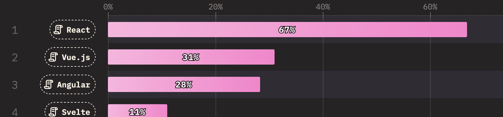
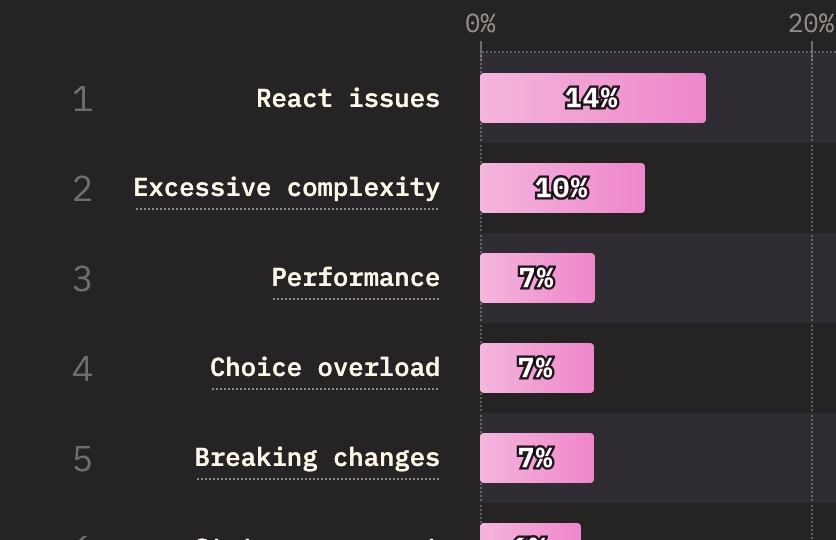

---
# You can also start simply with 'default'
theme: seriph
# random image from a curated Unsplash collection by Anthony
# like them? see https://unsplash.com/collections/94734566/slidev
# some information about your slides (markdown enabled)
title: Déconstruisons les frameworks JS pour mieux réinventer le web !
# apply unocss classes to the current slide
class: text-center
# https://sli.dev/features/drawing
drawings:
  persist: false
# slide transition: https://sli.dev/guide/animations.html#slide-transitions
transition: slide-left
# enable MDC Syntax: https://sli.dev/features/mdc
mdc: true
# open graph
# seoMeta:
#  ogImage: https://cover.sli.dev
layout: default
---

# Parler de la galère de chercher un travail

Anecdote de rechercher un emploi en react.js alors que je fais du vue.js

---

# Déconstruisons les frameworks JS pour mieux réinventer le web !

---
transition: fade-out
layout: center
class: text-center text-5xl align-center
---

# Faisons connaissance !

---
layout: center
transition: fade
---

  
  
  

---
layout: fact
---

<!-- Parler de qui a déjà codé sans framework ?-->
<h1 v-click="fade">
❓❓❓
</h1>

---
layout: center
---

# Les framework frontends les plus utilisés selon StateOfJs

---
layout: fact
---

# Mais où est le problème ?

---

# L'enfer des migrations

- Qui se souvient de la migration de AngularJS à Angular 2 ?
- Qui se souvient de la migration de Vue2 à Vue 3 ? (ou Nuxt 2 à Nuxt 3)
- Qui se demande encore quelle est la meilleure façon de faire du store ou du routing en react.js ?

---

# Locking : parler du fait d'être enfermé dans un stack technique qui contient tout

L'enfer de trouver des développeurs qui veulent faire du Gatsby

<!-- Parler par exemple de vercel avec next.js qui n'est pas évident -->

---

# Silos de compétences

Le ridicule d'être recalé à des rôles senior pour des frameworks JS car on n'a pas assez d'expérience en vue ou react

---
layout: quote
---

# Performance désastreuse (citer l'exemple de Astro, ou l'article sur if not react then what, parler de progressive enhancement)

Prendre peut-être l'exemple de wallmart ou de back market ?

---

# L'heure du changement

Il est nécessaire de commencer à faire autre chose. Est-ce qu'il est possible de faire les choses proprement ?

---
layout: statement
---

# Peut-on faire sans framework js ?

---

Un géant du commerce électronique : <https://www.teamblind.com/post/Tech-stack-at-amazon-hBy86wAQ>

Prendre les exemples de amazon, de netflix, qui n'utilisent pas de framework frontends pour certains de leurs besoins spécifiques

-> Introduire la notion de boring tech.
Prendre une approche pragmatique de la performance

Prendre une approche pragmatique de la réponse à un besoin : développer l'idée qu'un framework doit aider les gens à faire des choses.

Pourquoi le faire ?

<!-- Se pose la question de si je ne devrais pas mettre les exemples de sites qui font sans des frameworks JS plutôt vers la fin -->

---

# Faisons du web à l'ancienne

Un peu de live-coding ? Slow-coding ?

---

# La joie d'afficher du contenu statique

Montrer que c'est très facile d'afficher du contenu statique

Mais un premier code smell : la réutilisation de composants, sensation de se répéter.

--- 

# La sensation de réécrire du code : DRY vs WET

Parler du concept de convention vs configuration (jsx, single file component, angular component, jsp bindings, composables, fonctions)

Comment on pourrait réutiliser des éléments ?

---

# La réutilisation de composants par une approche conventions

- Écrire du JSX
- Importer du code chelou ? Se débrouiller pour réinventer HTMX ?
- Écrire des fonctions ou une sorte d'orienté objet

---

# La composition d'éléments : la grande différence pour expliquer pourquoi le dev-web est si différent du reste du monde

Décrire comment les applications utilisent de la composition, montrer les arbres syntaxiques de parcours, et comment on les explore.

---

# La nécessité de rendre le site web dynamique

Parler de l'enfer de gérer des états réactifs, se pose la question de ce qui pose le plus cher.

---

# L'horrible difficulté à écrire une gestion d'états

Parler des deux possibles approches : Faire du virtual dom ou faire de la réactivité par proxy

- Virtual DOM : un jeu d'acteurs
- Fined grained reactivity : un grand bingo

---

# Comment mettre de la réactivité dans notre système de composants

Avons-nous inventé mieux que les event listeners ?

Peut-on faire des proxies d'absolument tout ?

---

# Comment afficher dans le navigateur les choses que l'on a faites ?

Problème du rendering ? Bref, c'est compliqué.

---

# Au secours, ma réactivité fait n'importe quoi

L'enfer des circular loops, comment

---

# L'intégration avec le reste de l'écosystème

Blablabla avec vite, vitest et esbuild ou je sais pas ce qui va être utilisé

---
layout: end
---

Merci