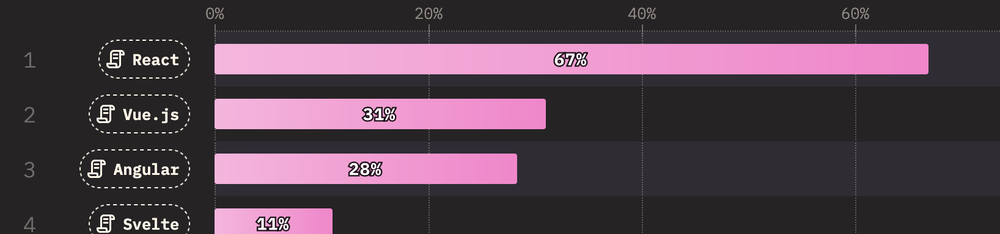
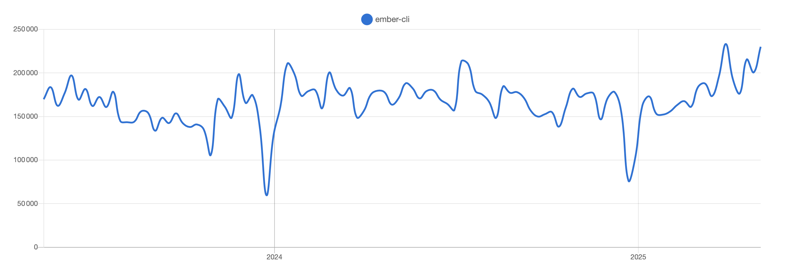
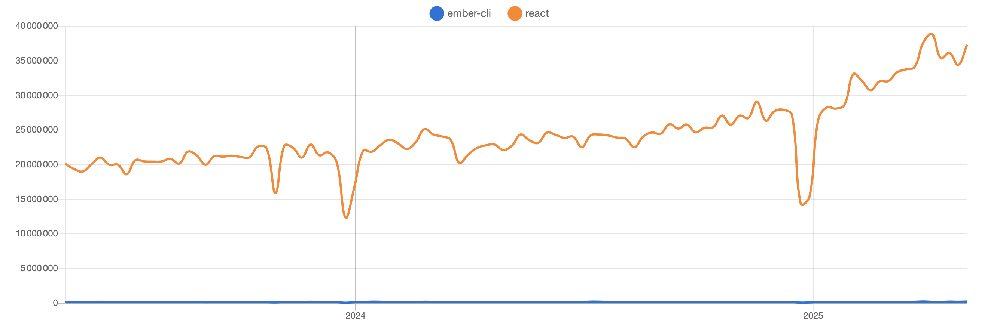
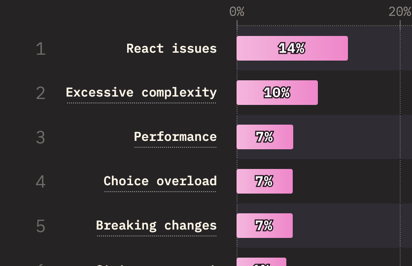

---
# You can also start simply with 'default'
theme: seriph
# random image from a curated Unsplash collection by Anthony
# like them? see https://unsplash.com/collections/94734566/slidev
# some information about your slides (markdown enabled)
title: Déconstruisons les frameworks JS pour mieux réinventer le web !
# apply unocss classes to the current slide
class: text-center
# https://sli.dev/features/drawing
drawings:
  persist: false
# slide transition: https://sli.dev/guide/animations.html#slide-transitions
transition: slide-left
# enable MDC Syntax: https://sli.dev/features/mdc
mdc: true
# open graph
# seoMeta:
#  ogImage: https://cover.sli.dev
layout: default
---

# Parler de la galère de chercher un travail

Anecdote de rechercher un emploi en react.js alors que je fais du vue.js

---

# Déconstruisons les frameworks JS pour mieux réinventer le web

---
transition: fade-out
layout: center
class: text-center text-5xl align-center
---

# Faisons connaissance

---
layout: center
transition: fade
---

  
  
  

---
layout: fact
---

<!-- Parler de qui a déjà codé sans framework ?-->
<h1>
∅
</h1>

---
layout: center
---

# Les framework frontends les plus utilisés selon StateOfJs

<!-- Confirmer le fait que les développeurs web utilisent principalement des frameworks pour faire leur travail

Prouver que le cadre est bien posé et donc enchaîner sur les problèmes que cela peut poser -->

---
layout: fact
---

# Mais où est le problème ?

---
layout: center
---

  FAIRE DU WEB

  FAIRE DU EMBER.JS

<!-- Parler de la difficulté de choisir un framework pour choisir son premier framework 

Parler de toutes les dingueries que cela implique : toujours plus spécialisé dans une technologie qui n'existe depuis pas si longtemps
Parler du fait que ça devient de moins en moins bien vu pour manipuler les autres frameworks

Comment avoir des opportunités d'utiliser d'autres frameworks ? Et surtout, les outils préférés ?

C'est là que j'ai besoin de parler du rêve : pouvoir emprunter des technologies venant d'autres frameworks et ensuite décider à la carte ce que l'on veut -->

---

---

---
layout: center
---

<!-- Years of academic training wasted -->
---

# L'enfer des migrations

- Qui se souvient de la migration de AngularJS à Angular 2 ?
- Qui se souvient de la migration de Vue2 à Vue 3 ? (ou Nuxt 2 à Nuxt 3)
- Qui se demande encore quelle est la meilleure façon de faire du store ou du routing en react.js ?
- Qui sait migrer une application faite en ember ?

---

# Locking : parler du fait d'être enfermé dans un stack technique qui contient tout

L'enfer de trouver des développeurs qui veulent faire du Gatsby

<!-- Parler par exemple de vercel avec next.js qui n'est pas évident -->

---

# Silos de compétences

Le ridicule d'être recalé à des rôles senior pour des frameworks JS car on n'a pas assez d'expérience en vue ou react

---
layout: quote
---

# Performance désastreuse (citer l'exemple de Astro, ou l'article sur if not react then what, parler de progressive enhancement)

Prendre peut-être l'exemple de wallmart ou de back market ?

---

# L'heure du changement

Il est nécessaire de commencer à faire autre chose. Est-ce qu'il est possible de faire les choses proprement ?

Parler de rêve : je rêve d'un monde dans lequel on peut facilement faire du web, sans avoir besoin d'être très fortement spécialisé dans des technologies obscures. Je rêve d'un monde ou les projets sont complexes, mais il est possible de les séparer en de petits éléments

Regarder comment on pourrait faire sans.

---
layout: statement
---

# Un exemple qui fait sens

---

Un géant du commerce électronique : <https://www.teamblind.com/post/Tech-stack-at-amazon-hBy86wAQ>

Prendre les exemples de amazon, de netflix, qui n'utilisent pas de framework frontends pour certains de leurs besoins spécifiques

-> Introduire la notion de boring tech.
Prendre une approche pragmatique de la performance

Prendre une approche pragmatique de la réponse à un besoin : développer l'idée qu'un framework doit aider les gens à faire des choses.

Pourquoi le faire ?

<!-- Se pose la question de si je ne devrais pas mettre les exemples de sites qui font sans des frameworks JS plutôt vers la fin -->

---

# Faisons du web à l'ancienne

Un peu de live-coding ? Slow-coding ?

---

# La joie d'afficher du contenu statique

Montrer que c'est très facile d'afficher du contenu statique

Mais un premier code smell : la réutilisation de composants, sensation de se répéter.

---

# La sensation de réécrire du code : DRY vs WET

Parler du concept de convention vs configuration (jsx, single file component, angular component, jsp bindings, composables, fonctions)

Comment on pourrait réutiliser des éléments ?

---

# La réutilisation de composants par une approche conventions

- Écrire du JSX
- Importer du code chelou ? Se débrouiller pour réinventer HTMX ?
- Écrire des fonctions ou une sorte d'orienté objet

---

# La composition d'éléments : la grande différence pour expliquer pourquoi le dev-web est si différent du reste du monde

<!-- C'est la partie compliquée du talk, comme dans le précédent, réussir à amener très progressivement un petit peu tout -->

Décrire comment les applications utilisent de la composition, montrer les arbres syntaxiques de parcours, et comment on les explore.

Réussir à faire la peinture initiale du site !!!

Montrer que `vite.js` fait incroyablement bien les choses en zéro configuration

---

# Tout ce que l'on peut réussir à faire sans javascript en ayant un code plutôt joli

Des jolies homepage, des animations et des transitions

---

# La nécessité de rendre le site web dynamique

Parler de l'enfer de gérer des états réactifs, se pose la question de ce qui pose le plus cher.

Parler d'exemples d'intéractivité qui nécessitent du javascript

---

# L'horrible difficulté à écrire une gestion d'états

Parler des deux possibles approches : Faire du virtual dom ou faire de la réactivité par proxy

- Virtual DOM : un jeu d'acteurs
- Fined grained reactivity : un grand bingo

---

# Comment mettre de la réactivité dans notre système de composants

Avons-nous inventé mieux que les event listeners ?

Peut-on faire des proxies d'absolument tout ?

<!-- Je me rends compte qu'on ne pourra pas tout faire en fait, donc je vais plutôt choisir un grand chemin pour réussir à faire proprement ma réactivité.

Peut-être parler de stores et de voir comment on va réussir à les implémenter à la main -->

<!-- C'est là qu'on se met à faire faire le bingo avec les deux parties -->
<!-- je me dis que ce serait trop cool de le faire en deux temps : d'abord le jeu de rôles, et ensuite le jeu du bingo. Bref, il se passera plein de choses -->

---

# Les façons d'implémenter des proxies

- parler de liste de listeners
- parler de proxy function
- parler de whatever qui est à la mode ?

---

# Implémentons notre propre listener !

On va implémenter des proxies et ce sera beaucoup plus simple de tout afficher

---

# Comment afficher dans le navigateur les choses que l'on a faites ?

Problème du rendering ? Bref, c'est compliqué.

---

# Au secours, ma réactivité fait n'importe quoi

L'enfer des circular loops, comment

---

# L'intégration avec le reste de l'écosystème

Blablabla avec vite, vitest et esbuild ou je sais pas ce qui va être utilisé

---

# Parler d'une architecture

- Module federation
- Microfrontends

Pas de meilleur choix, mais important que l'architecture du projet permette de facilement revenir en arrière dans le web (c'est un MUST have)

Exemple :

---

# Rappeler que le SSR et SSG aident énormément

---

# Pour aller plus loin

Parler du talk de JS sur les designs systems et le fait de le faire sans aide.

---
layout: end
---

Merci
