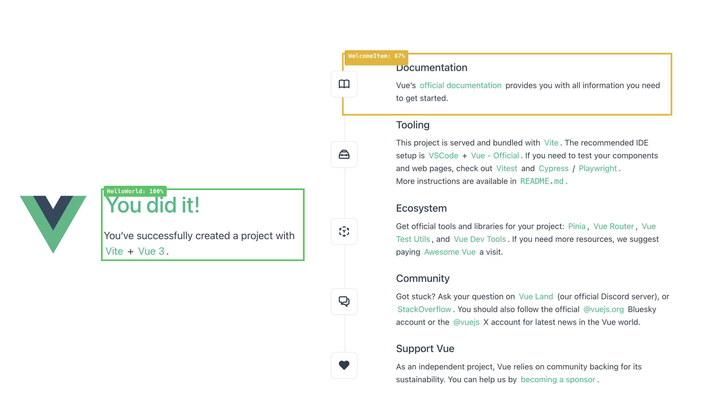

# @seboran/vue-coverage-overlay

A Vite plugin that visualizes Vue component test coverage directly on your running application. No browser extension needed.



## Features

- 📊 **Visual coverage overlay** - See which components have test coverage at a glance
- 🎨 **Color-coded** - Green (80%+), Yellow (60-79%), Orange (40-59%), Red (<40%)
- 🔘 **Toggle button** - Floating button to enable/disable overlays
- ⌨️ **Keyboard shortcut** - `Ctrl+Shift+C` to toggle (configurable)
- 💾 **Persistent state** - Remembers your preference across reloads
- 🚀 **Works with SSR** - Compatible with Nuxt and other SSR frameworks

## Installation

```bash
npm install @seboran/vue-coverage-overlay --save-dev
# or
pnpm add -D @seboran/vue-coverage-overlay
```

## Usage

### Vite

```js
// vite.config.js
import { vueCoverageOverlay } from '@seboran/vue-coverage-overlay'

export default {
  plugins: [
    vueCoverageOverlay()
  ]
}
```

### Nuxt

```ts
// nuxt.config.ts
import { vueCoverageOverlay } from '@seboran/vue-coverage-overlay'

export default defineNuxtConfig({
  vite: {
    plugins: [
      vueCoverageOverlay()
    ]
  }
})
```

## Configuration

```js
vueCoverageOverlay({
  // Path to coverage file (relative to project root)
  coveragePath: 'coverage/coverage-final.json',
  
  // Endpoint to serve coverage data
  endpoint: '/__coverage',
  
  // Keyboard shortcut to toggle overlay
  shortcut: 'ctrl+shift+c',
  
  // Enable overlay by default on page load
  enabledByDefault: false
})
```

## Vitest Configuration

Make sure Vitest outputs coverage in JSON format:

```js
// vitest.config.js
export default {
  test: {
    coverage: {
      reporter: ['json', 'html'], // 'json' is required
      reportsDirectory: 'coverage'
    }
  }
}
```

## How It Works

1. **Run tests with coverage**: `pnpm test:coverage`
2. **Start dev server**: `pnpm dev`
3. **Click the 📊 button** (bottom-right) or press `Ctrl+Shift+C`
4. **See coverage overlays** on your Vue components

The plugin:
- Serves coverage data at `/__coverage`
- Injects a client script that scans for Vue components
- Applies colored outlines based on coverage percentage
- Updates dynamically as you navigate

## Color Legend

| Color | Coverage |
|-------|----------|
| 🟢 Green | 80%+ |
| 🟡 Yellow | 60-79% |
| 🟠 Orange | 40-59% |
| 🔴 Red | < 40% |

## License

MIT
